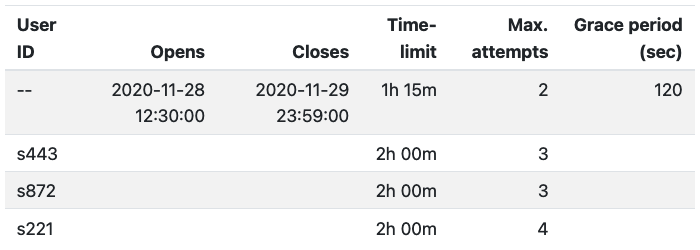

```{r setup, include = FALSE}
knitr::opts_chunk$set(collapse = TRUE, comment = "#>", error = TRUE, warning = TRUE)
esc <- function(code) {
  sprintf('`r %s`', rlang::enexprs(code))
}
begin_rmd_block <- function(header = 'r') {
  sprintf('```{%s}', header)
}
end_rmd_block <- function(header) {
  '```'
}
```

Access to an exam is determined on two factors: _who_ is accessing the exam and _when_ is the exam accessed.
The first factor, _who_ is accessing the exam, is resolved through the _authentication provider_.
Once the user is authenticated, either a new attempt is started or an unfinished attempt is resumed.
Whether the user is allowed to start a new attempt or resume an old attempt is determined by the global or user-specific attempt configuration.

## Authentication providers

Currently, examinr ships with only three authentication providers: `rsconnect_auth()`, which uses the RStudio Connect user information, as well as `password_auth()` and `ui_token_auth()` which show a login screen when the learner loads the exam.

### Login screen

The `password_auth()` and `ui_token_auth()` authentication providers work on every shiny server.
Learners visiting the exam URL are prompted either for

- a username and password (`password_auth()`), or
- a login token (`ui_token_auth()`),

which have to be somehow distributed to the learners beforehand.

### RStudo Connect

RStudio Connect exposes the current user in `session$user` and the group membership of the user in  `session$groups`.
The `rsconnect_auth()` authentication provider uses this information and allows you to give grading permission to certain groups.
For example

```r
#! context="server-start"
exam_config(auth_provider = rsconnect_auth(grading_groups = c('instructor', 'ta')))
```

would use the RStudio Connect user name as `user_id` and set `grading=TRUE` to any user with membership in either the _instructor_ or _ta_ group.

You can also write your own authentication provider which takes information from the session object (e.g., from the query string) to authenticate users.
The authentication provider can add more information to the user object than specified above.
Any function receiving the user object as input will receive all the information returned by the authentication provider.


### Writing a custom authentication provider

Loosely speaking, the authentication provider determines who the user is and relays this information in a standardized form to examinr.
The authentication provider is set via `exam_config(auth_provider=)`, which requires a function taking the Shiny session as argument and returning a _user object_.
The _user object_ is an R list with the following entries

Name                 Description
---------------      --------------------------------------------------
`user_id`            a character string uniquely identifying the user
`grading`            (optional) a logical value indicating if the user has permission to grade attempts
`display_name`       (optional) a character string with a human-readable name to be displayed while grading

The `user$user_id` must be present and uniquely identifies a user for the exam.
If `user$grading` is present and is `TRUE`, the user has the ability to access the grading interface.
Also, if `user$display_name` is present it will be shown in lieu of the user id when grading, but be aware of privacy issues when storing the exam data in an unencrypted database. See also the information for [storage providers](config_storage.html).


## Attempt configuration

The attempt configuration consists of the following options

Option          Description                                                                                               Default value
----------      -------------------------------------------------------------------------------------------------------   ----------------
`opens`         date-time when the exam "opens", i.e., becomes available to users                                          `NA`
`closes`        date-time when the exam "closes", i.e., becomes unavailable to users                                       `NA`
`max_attempts`  number of attempts a user is afforded                                                                      `Inf`
`timelimit`     time a user can take for a single attempt                                                                  `Inf`
`grace_period`  seconds a user has to submit an unfinished attempt after the time limit has passed or the exam closed      `NA`


The default attempt configuration (i.e., the configuration applying to all users unless overridden) is set in the YAML front matter of the exam document via options passed on to the output format `exam_document()`, e.g.:

```yaml
output:
  examinr::exam_document:
    opens: 2020-11-28 12:30 America/Vancouver
    closes: 2020-11-29 23:59 America/Vancouver
    max_attempts: 2
    timelimit: 1:15
    grace_period: 60
```

The opens/closes date-time must be given in the format _YYYY-MM-DD HH:MM Timezone_.
The above example configuration would make the exam available between 12:30 on Nov 28 and 23:59 on Nov 29, 2020 (the time is taken as the local time in Vancouver, Canada).
Each user can take at most 2 attempts.

An attempt must be finished either within 1 hour and 15 minutes of starting the attempt, or at the closing time (whichever comes first).
If the time runs out, the user is given 60 seconds to submit their exam.
After this grace period the exam is disabled and all input up to this point is recorded automatically.

The attempt configuration can be overridden for specific users (e.g., to give them more time or more attempts).
This is done by calling `configure_attempts()` in an R code chunk with `context="server-start"`.
For instance, to give users _s443_ and _s872_ 2 hours for the exam, and give user _s221_ more attempts, you would use

```r
#! context="server-start"
configure_attempts(c("s443", "s872"), timelimit = "2:00")
configure_attempts("s221", max_attempts = 3)
```

This allows fully customization for user's specific needs and requests.
The last call to `configure_attempts()` for a certain user and specific option will be the one taking effect.
The following example would give users _s443_, _s872_, and _s221_ 2 hours to complete the exam, but users _s443_ and _s872_ would get 3 attempts, while user _s221_ gets 4.

```r
#! context="server-start"
configure_attempts(c("s443", "s872", "s221"), timelimit = "2:00", max_attempts = 3)
configure_attempts("s221", max_attempts = 4)
```

To disable opening or closing date-times (i.e., making the exam accessible as soon as it is uploaded or for the rest of time), set the option to `NA`.
Similarly, disabling time limits and attempt counters, set the options to `Inf`.

Correct attempt configurations are critical for ensuring integrity of an exam.
For debugging, you can verify the attempt configuration in your exam by printing the final configuration in the exam document with `show_attempts_configuration()`.
Simply add an R code chunk to your exam which calls this function, e.g.,

````markdown
`r begin_rmd_block("r, exercise.static=TRUE")`
show_attempts_configuration()
`r end_rmd_block()`
````

For the example here this would give

{width=75%}

A blank cell indicates that the global configuration (first line with user id `--`) is in effect for the respective option and user.
