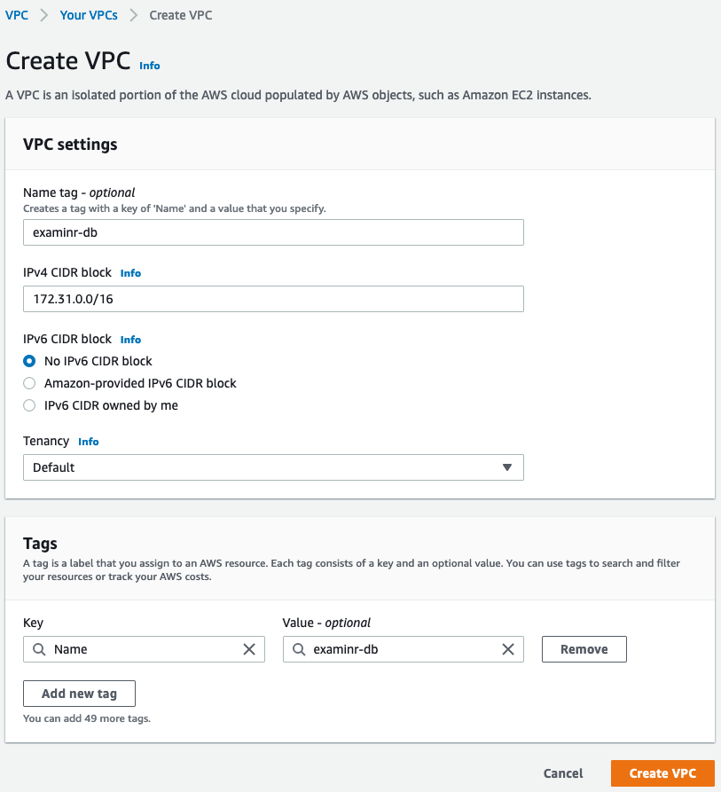
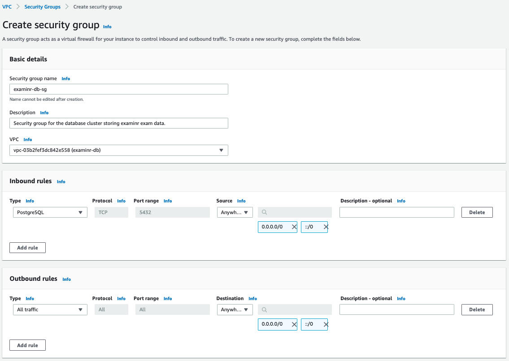
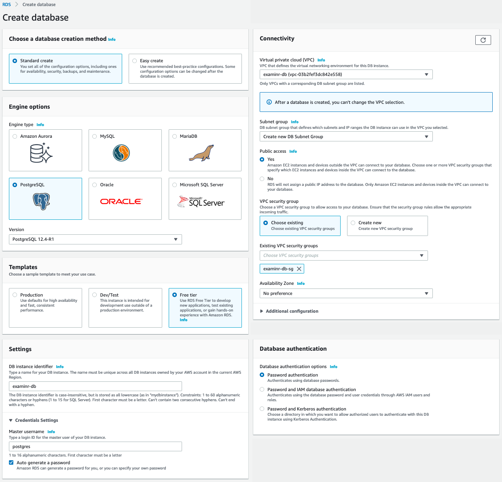
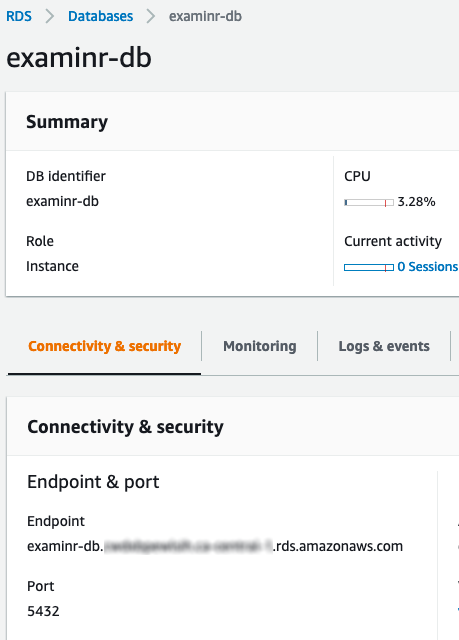
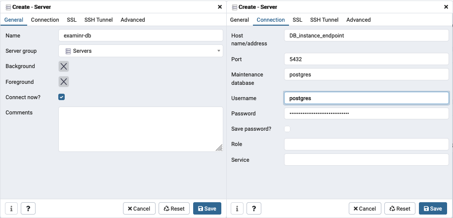
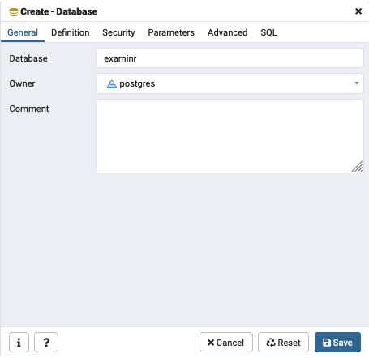
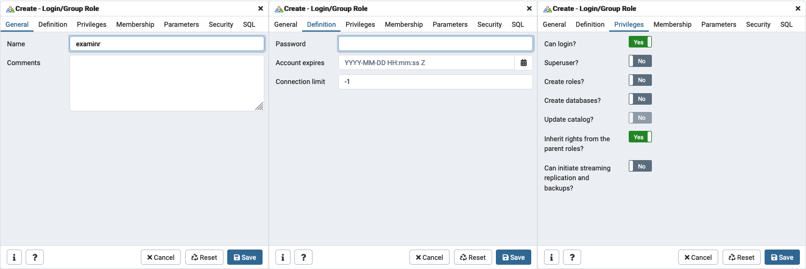
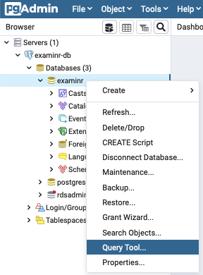

```{r setup, include = FALSE}
knitr::opts_chunk$set(collapse = TRUE, comment = "#>", error = TRUE, warning = TRUE)
esc <- function(code) {
  sprintf('`r %s`', rlang::enexprs(code))
}
begin_rmd_block <- function(header = 'r') {
  sprintf('```{%s}', header)
}
end_rmd_block <- function(header) {
  '```'
}
```

If you don't have access to your own shiny server or database server, hosting exams may seem intriguing.
A simple alternative to acquiring, setting up, and managing your own infrastructure is to use cloud-based hosting providers.
This guide showcases how to use [shinyapps.io](https://www.shinyapps.io) for hosting the exam and [AWS RDS](https://aws.amazon.com/rds/) for hosting the database.
Of course there are numerous other hosting providers which may better suite your needs or preferences, and many of the steps outlined here can be easily translated to these other providers.

**Important caveats when using hosting services such as shinyapps.io:**

* **Security:** it is not safe to add exercise questions to exams hosted on shinyapps.io, as there is no way of preventing the user-code from accessing the exam document file (a learner could see the solutions).
  Even more concerning, learners could access the credentials used for the database connection!
* **Costs:** some of the services used in this guide may incur costs.
[shinyapps.io](https://www.shinyapps.io) offers a free account which is sufficient for trying out exam documents, and may be enough to administer an exam to a small group of learners.
The RDS service hosted by [Amazon AWS](https://aws.amazon.com) also has a _free tier_ program (for up to 1 year), which gives you access to a database for testing or few learners.
If you need to provision for exams for a larger number of learners, the free services may not be sufficient.
However, you can easily scale up the database and/or the shinyapps.io resources without having to redo the setup.
Similarly, you can stop the database during times you don't need it and you will not pay anything for running the database.
If you are above the free tier usage limits for storage size, you would continue to pay for the storage.
But it is very unlikely that you would come close to the free tier limits if you store only data from examinr exams.

The following guide explains how to use the free services provided by shinyapps.io and Amazon AWS and you will need

* an [Amazon AWS](https://aws.amazon.com) account
* an account on [shinyapps.io](https://www.shinyapps.io) (a free account is sufficient for now)
* [pgAdmin 4](http://www.pgadmin.org/) or the `psql` command line utility on your local computer
* the RStudio IDE

The three steps covered in this guide are

1. Setting up a database on AWS RDS.
1. Preparing the exam document to use the new database.
1. Publishing the exam to shinyapps.io.

## Step 1: Setting up a database on AWS RDS

Log in to the [Amazon AWS Management Console](https://console.aws.amazon.com).
Ensure you are operating in the AWS region your database should be hosted in (can be selected in the top right corner of the management console).
This is relevant if you have to follow certain data privacy laws which mandate the location where data needs to be stored.

### Step 1.1: Configure the cluster network

#### Step 1.1.1: Set up a VPC
Go to the service _VPC_ to configure the "virtual private cloud" network.
This is a "virtual network" in which the database server will be launched in.

1. Click on _Create VPC_.
2. Set the name of the VPC to something descriptive, e.g., `examinr-db`.
3. Use an IPv4 CIDR block of `172.31.0.0/16`.
4. Click on _Create VPC_.

{width=50%}

#### Step 1.1.2: Create a security group

Next you need to create a security group which specifies through what channels someone can access the server inside the VPC and also how the server inside the VPC may communicate with the outside.

1. In the navigation on the left, click on _Security Groups_.
1. Click on _Create Security Group_.
1. Set a descriptive name for the security group, e.g., `examinr-db-sg`.
1. Add a description, e.g., `Security group for the database cluster storing examinr exam data.`.
1. Select the previously created VPC (`examinr-db`).
1. Under **Inbound rules** click on _Add rule_.
    1. Under **Type** select _PostgreSQL_.
    1. Under **Source** select _Anywhere_.
       If you don't want to restrict network access to your database, you can white-list only your local computer (by selecting _My IP_) and the the shinyapps.io network (see the [official documentation](https://docs.rstudio.com/shinyapps.io/applications.html#firewalls) for a list of IP addresses).
1. The **Outbound rules** can be left as-is.
4. Click on _Create security group_

{width=100%}

Now you have defined a network which allows inbound traffic only to the database.

### Step 1.1: Create a database instance

Go to the service _RDS_ to create you database instance

1. Click on _Create database_. Ensure again that you are in the correct region!
1. Under **Choose a database creation method**, select _Standard create_.
1. Under **Engine options**, select _PostgreSQL_ as the engine type and leave the selected version.
1. Under **Templates**, select _Free tier_.
1. Under **Settings**, use a descriptive name for the DB instance identifier, e.g., `examinr-db`.
   Leave the master username as `postgres` and select *Auto generate a password* as this is the most secure option.
   **Important:** this is a very, very sensitive password and hence should be very complex. You will use this password only once and you can specify a new password in the AWS console if you forget it, so there is no need to make the password easy to memorize or anything. Anyone with this password can access all the exam data!
1. Leave the settings under **DB instance size**, **Storage**, and **Availability & durability** as they are.
   You can increase the instance size and storage size later when your database becomes a bottleneck for the exam (e.g., if your exam is used by > 20 learners at a time).
1. Under **Connectivity**, select the following
   1. Select the VPC you created in [Step 1.1.1](#step-1.1.1-set-up-a-vpc).
   1. Under Public access, select _Yes_.
1. Under **Database authentication**, select _Password authentication_.
1. If you chose to automatically generate the password, the _View credential details_ button appears on the Database page.
   To view the password for the DB instance, click on _View credential details_.
   Take note of the password as you cannot view it again (but you can change the master password anytime in the AWS console).

{width=100%}

The new database will take a few minutes to be created and started.

### Step 1.2: Create a database on the DB instance

Once the new database is launched, click on the DB identifier `examinr-db` to get the summary information for the new database.
Locate the endpoint URL:

{width=40%}

If you use [pgAdmin 4](https://www.pgadmin.org), you need to use the information from the summary page to set up the connection to the DB instance.
Start pgAdmin 4, click on _Object_ > _Create_ > _Server_, and enter the details for the server connection, as shown in the figure below (replace *DB_instance_endpoint* with the endpoint URL of the DB instance)
Click on _Save_.

{width=67%}

When connected to the DB instance, you need to create a database for the exam data.
In pgAdmin 4, click on _Object_ > _Create_ > _Database_ and enter `examinr` as _Database_ name.
Click on _Save_.

{width=33%}

If you have the `psql` command line utilities installed, you can also run the following command in your shell  (replace *DB_instance_endpoint* with the endpoint URL of the DB instance):

```sh
createdb \
  --host=DB_instance_endpoint \
  --port=5432 \
  --username=postgres \
  --encoding=UTF8 \
  examinr
```

### Step 1.3: Create a database role

Once the database is created, you need to create a role, i.e., the DB user used for connecting to the database from the exam document).

If you use pgAdmin 4, click on _Object_ > _Create_ > _Login/Group Role_:

* Under _General_, enter the name for the role, e.g., `examinr`.
* Under _Definition_, enter the password for the role.
* Under _Privileges_, set _Can login?_ to _Yes_ and leave the others as _No_.

Click on _Save_.

{width=100%}

If you have the `psql` command line utilities installed, you can add the role by starting the `psql` shell with (replace *DB_instance_endpoint* with the endpoint URL of the DB instance):

```sh
psql \
  --host=DB_instance_endpoint \
  --port=5432 \
  --username=postgres \
  --dbname=examinr
```

This opens a shell where you can enter SQL and `psql` commands:

```
psql (12.1, server 12.4)
SSL connection (protocol: TLSv1.2, cipher: ECDHE-RSA-AES256-GCM-SHA384, bits: 256, compression: off)
Type "help" for help.

examinr=>
```

The role `examinr` can be created created by running the following two commands:

```
CREATE ROLE examinr WITH LOGIN NOSUPERUSER NOCREATEDB NOCREATEROLE;
\password examinr
```

### Step 1.4: Create the tables

Open a query tool in pgAdmin 4 for the `examinr` database by clicking on the _examinr_ database and then using right-click on the database to start the query tool:

{width=30%}

If using the `psql` command line utilities, connect to the `examinr` database with:

```sh
psql \
  --host=DB_instance_endpoint \
  --port=5432 \
  --username=postgres \
  --dbname=examinr
```

Either in the query tool (if using pgAdmin 4) or in the `psql` shell, run the following SQL commands:

```sql
CREATE TABLE attempts (
  attempt_id   uuid              PRIMARY KEY,
  user_id      character varying NOT NULL,
  exam_id      character varying NOT NULL,
  exam_version character varying NOT NULL,
  started_at   double precision  NOT NULL,
  seed         integer           NOT NULL,
  user_obj     text              NOT NULL,
  finished_at  double precision,
  points       text
);

CREATE INDEX attempts_index ON attempts (user_id, exam_id, exam_version);

CREATE TABLE section_data (
  id           serial            PRIMARY KEY,
  attempt_id   uuid              NOT NULL REFERENCES attempts (attempt_id)
                                          ON DELETE CASCADE ON UPDATE CASCADE,
  section      character varying NOT NULL,
  saved_at     double precision  NOT NULL,
  section_data text
);

CREATE INDEX section_data_index ON section_data (attempt_id, section);

GRANT CONNECT ON DATABASE examinr TO examinr;
GRANT SELECT, INSERT, UPDATE ON attempts TO examinr;
GRANT SELECT, INSERT, DELETE ON section_data TO examinr;
GRANT USAGE ON section_data_id_seq TO examinr;
```

Now your database is all set up and ready to be used from the exam document.


## Step 2: Using the new database in an exam

You can now create an exam which uses the newly created database.
In RStudio, click on _File_ > _New File_ > _R Markdown…_.
Select _From Template_ and select the _Exam_ template.
Enter the name of the exam document and where to save the exam.

You would go about creating the exam as usual, but you also need to give the exam document the connection credentials (i.e., the name and password for the role you created before).
The easiest way is to create the file _.Renviron_ in the directory of the exam document.
The contents of this file would be

```
PGUSER='examinr'
PGPASSWORD='password_for_database_user_examinr'
```

You need to replace *password_for_database_user_examinr* with the actual password you entered when creating the database role `examinr`.
For more control, you could use the config package.

**Important:** The file is readable by the user-code from exercises and hence would expose your database credentials.
Currently, it is not safe to add exercise questions to exams hosted on shinyapps.io, as there is no way of preventing the user-code from accessing the credentials file.

Now you are ready to set up the connection with the database in the exam document.
The connection is established in a code chunk with _server-start_ context, as in the following sample exam.

````md
---
title: "Exam Using AWS RDS"
lang: en-US
output:
  examinr::exam_document:
    id: exam-using-aws-rds
    version: 0.1
    progressive: no
    feedback: immediately
runtime: shiny_prerendered
---

`r begin_rmd_block("r setup, include=FALSE")`
# Load the package
library(examinr)
knitr::opts_chunk$set(echo = FALSE)
`r end_rmd_block()`

`r begin_rmd_block("r, context=\"server-start\"")`
library(pool)
library(RPostgres)

# Establish a pool of connections to the database.
# User-name and password are taken from environment variables
# PGUSER and PGPASSWORD, respectively.
db_con <- dbPool(drv = Postgres(),
                 dbname = "examinr",
                 host = "db-examinr-testing.cwdxbpewlsih.ca-central-1.rds.amazonaws.com",
                 timezone = "UTC",
                 minSize = 1, maxSize = 1)

# Close the DB connection when shiny stops.
shiny::onStop(function () { poolClose(db_con) })

# Instruct the `future` package to run the user-supplied code in a separate R process.
library(future)
plan(cluster, workers = 1)

# Use the new database as storage provider.
exam_config(storage_provider = dbi_storage_provider(db_con, 'attempts', 'section_data')
`r end_rmd_block()`

# Introduction

This simple exam demonstrates how to use a database instance hosted on AWS RDS
for storing exam data.
It is important to keep the DB instance secured and the master password secret.

# Questions

`r begin_rmd_block("r q-1")`
mc_question(
  title = "Where is the exam data stored?",
  checkbox = FALSE,
  answer("On an Amazon AWS RDS database instance.", correct = TRUE),
  answer("In a SQLite database file."),
  answer("In a SQLite database in memory."),
  answer("On a database somewhere on the internet."),
  answer("The data is not saved anywhere.")
)
`r end_rmd_block()`


`r begin_rmd_block("r q-2")`
mc_question(
  title = "How to avoid privacy and security issues?",
  answer("Ensure the DB instance is running in the correct AWS region.", correct = TRUE),
  answer("Use a complex master password for the DB instance and not share it.", correct = TRUE),
  answer("Do **not** add exercise question as they may expose the database credentials", correct = TRUE),
  answer("Use a random endpoint URL for the DB instance."),
  answer("Do not tell anybody that the database is hosted on AWS RDS."),
  answer("Amazon AWS guarantees security of the data and that privacy issues are avoided.")
)
`r end_rmd_block()`

````

## Step 3: Publishing the exam to shinyapps.io

First you need to install the latest version of the rsconnect package by running the following R command:

```r
install.packages('rsconnect')
```

You need to authorize RStudio to publish documents to your shinyapps.io account by following the instructions in the [shiny documentation](https://shiny.rstudio.com/articles/shinyapps.html).

Once you completed the exam document, click on _Publish Document…_ in the top right corner of the RStudio IDE.
On the left the _.Rmd_ file, the database credentials (_www/pgauth.yaml_) and any other resource file the exam needs.
On the right, select your shinyapps.io account and set the name of the exam and click _Publish_.


## Scaling up/down to meet your demand

The database instance on AWS RDS and the shiny server on shinyapps.io can be scaled up if your exam needs to be accessed by a larger number of learners.
You can also monitor the load of the DB instance and your shiny app to decide if more resources are needed for your number of learners.
Note, however, that scaling the shiny server or DB instance up/down will take them offline for several minutes, making the exam inaccessible during this time.
If you are not sure if your number of learners will require more resources than available for free, it is suggested to administer a low-stakes exam to your learners and monitor the load of the DB instance and shiny server.
If you notice the any of the services buckle under the load, you have to consider scaling up the resources.

In most use-cases it would also make sense to scale up resources for the duration of the actual exam (when many learners access the exam at the same time) and scale back down after the exam.
Grading and accessing feedback are typically less demanding as the load is spread more over time.
In many cases, a large number of learners submits the exam at the same time, leading to a very high load on the database and shiny server for a brief moment.
Being able to handle these substantial spikes is important for a smooth exam experience.
After this rush, however, demand will be minimal.

### Scaling the DB instance

AWS RDS offers a wide range of instance sizes.
The free tier applies only to the smallest instance (currently `db.t3.micro`).
For most exams, "burstable" instance classes are sufficient and much cheaper than standard or optimized instance classes.

You can also stop the DB instance during times where no exam needs to be accessible.
You will not be billed for computing time while the instance is stopped, but the charges for storage will continue.
The size of the exam data, however, is small and would not incur high costs.

### Scaling the shiny server

Your shinyapps.io account gives you the option to purchase monthly or yearly plans.
You would only get more resources when subscribing to at least the _Basic_ plan.
These plans allow you to use more than 1 instance and more than 1 worker process per instance for your exam.

To increase the number of instances/worker processes for your exam, go to your exam shiny app on shinyapps.io and click on _Settings_.
Here you have three main knobs to increase the number of learners you can serve simultaneously:

* Under _General_, you can select a larger instance size; the more memory the more learners you can serve.
* Under _Advanced_, you can set:
  * The start count under instance settings determines how many instances are started at the beginning.
    If you expect all your learners to access the exam at the same time, this should be set to the maximum value (depends on your plan). Note that a larger number of instances depletes your allocated number of active hours more quickly.
  * The maximum number of worker processes (up to 10). All these processes run in the same instance, so 10 processes may even slow down the server. It is suggested to use 3 — 6 processes.

You should ensure that your plan allows you to have enough instances number of worker processes such that your exam can serve the expected number of learners:

$$
\text{Number of learners} > \text{Max Worker Processes} \times \text{Maximum Instances Limit} \times \text{Max Connections}
$$

The [shinyapps.io user guide](https://docs.rstudio.com/shinyapps.io/applications.html) has comprehensive information on setting and tuning application performance.
