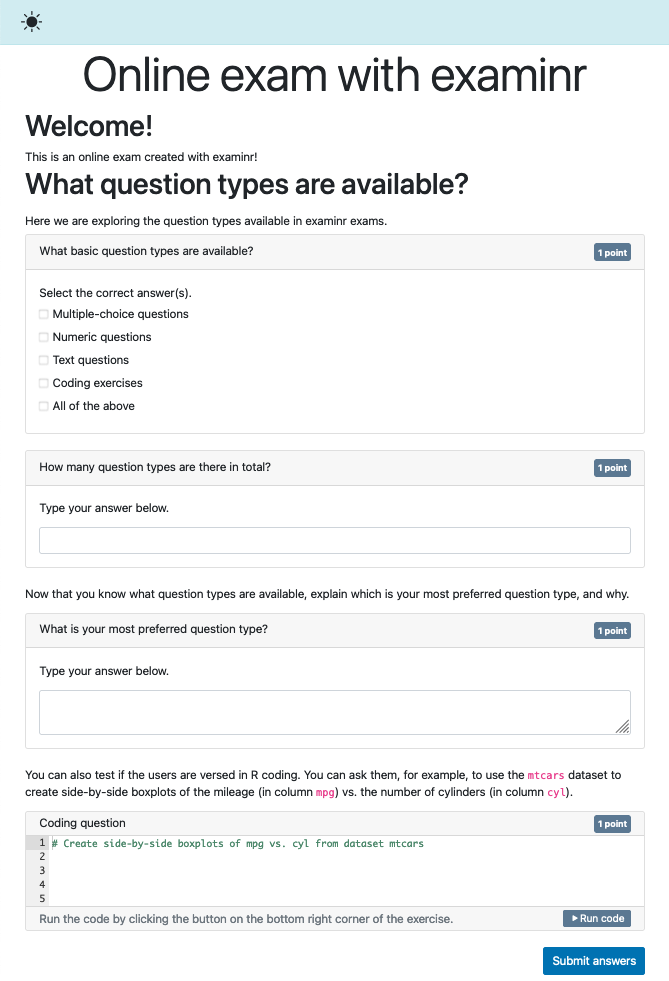
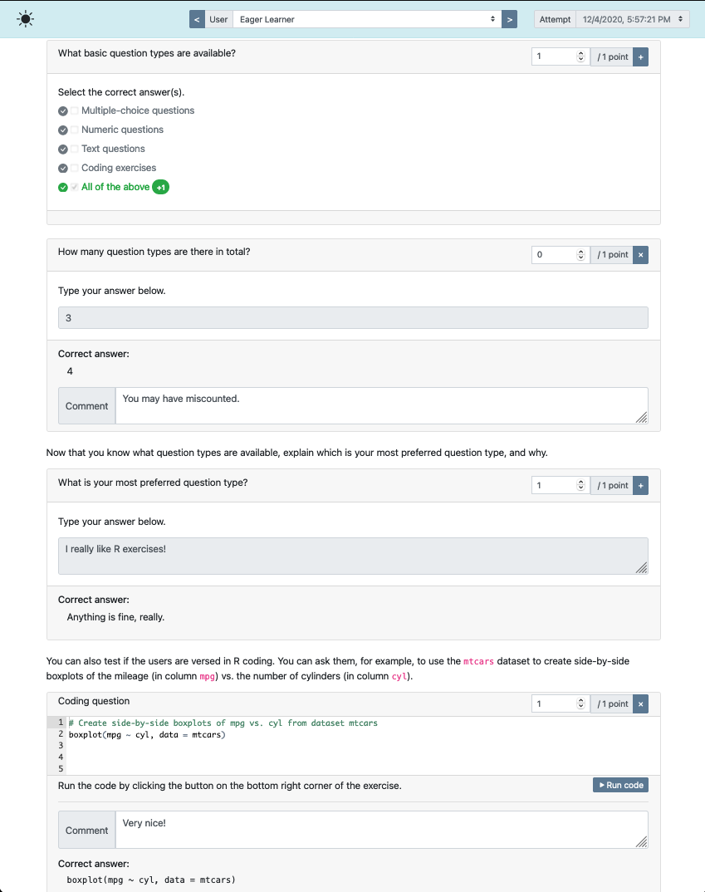
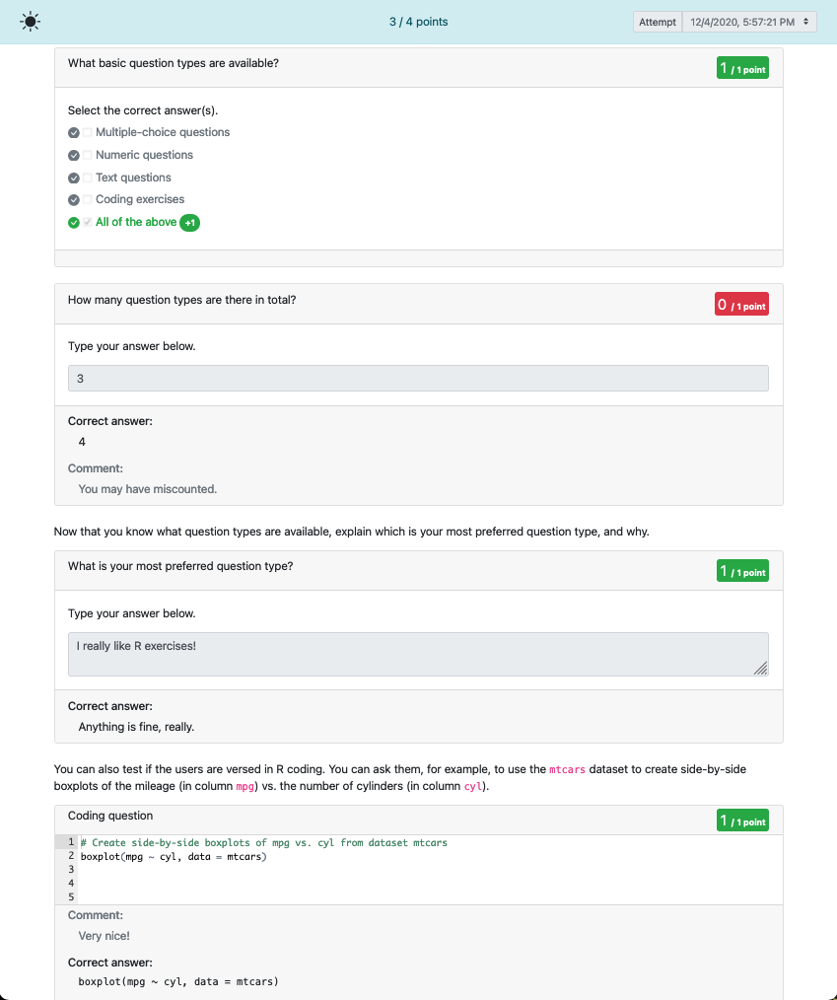
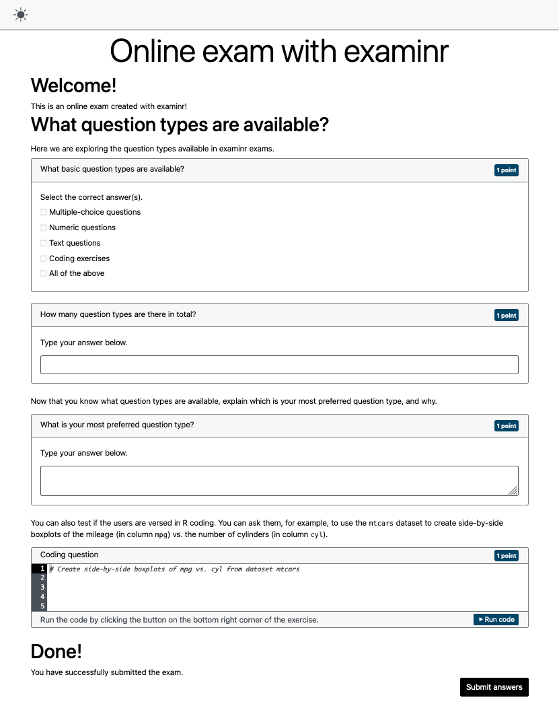

```{r setup, include = FALSE}
knitr::opts_chunk$set(collapse = TRUE, comment = "#>", error = TRUE, warning = TRUE)
esc <- function(code) {
  sprintf('`r %s`', rlang::enexprs(code))
}
begin_rmd_block <- function(header = 'r') {
  sprintf('```{%s}', header)
}
end_rmd_block <- function(header) {
  '```'
}
```

examinr is a one-stop solution for creating, conducting, and grading online exams.
Exams are written as R markdown documents and delivered as a Shiny app which can be hosted on any Shiny server.
You can _randomize_ exams such that every learner receives a different version of the exam.

You (and other authorized users) can grade exams, with several question types supporting automated grading.
Learners can be given access to graded exams, including personalized feedback.

You do not have to worry about learners being able to access questions before they are made available: the HTML page sent to the browser does not contain the question texts.
They are only populated with the learners individualized content at the time they are given access.

## Creating an exam document

You can create a new exam document from the provided R markdown template by following the [instructions for RStudio](https://rstudio.github.io/rstudio-extensions/rmarkdown_templates.html) or using the `rmarkdown::draft` function:

```r
rmarkdown::draft("newexam.Rmd", template = "exam", package = "examinr")
```

Exams are standard R markdown documents and are configured via the YAML front-matter.
Let us consider the following simple exam document:

````md
---
title: "Online exam with examinr"
lang: en-US
output:
  examinr::exam_document:
    id: online-exam-with-examinr
    version: 0.1
runtime: shiny_prerendered
---

`r begin_rmd_block("r setup, include=FALSE")`
library(examinr)
knitr::opts_chunk$set(echo = FALSE)
`r end_rmd_block()`

# Welcome!

This is an online exam created with examinr!

# What question types are available?

Here we are exploring the question types available in examinr exams.

`r begin_rmd_block("r q-1")`
mc_question(
  title = "What basic question types are available?",
  random_answer_order = FALSE,
  answer("Multiple-choice questions"),
  answer("Numeric questions"),
  answer("Text questions"),
  answer("Coding exercises"),
  answer("All of the above", correct = TRUE)
)
`r end_rmd_block()`

`r begin_rmd_block("r q-2")`
text_question(
  title = "How many question types are there in total?",
  type = "numeric",
  solution = 4
)
`r end_rmd_block()`

Now that you know what question types are available, explain which is your most
preferred question type, and why.

`r begin_rmd_block("r q-3")`
text_question(
  title = "What is your most preferred question type?",
  solution = "Anything is fine, really."
)
`r end_rmd_block()`

You can also test if the users are versed in R coding.
You can ask them, for example, to use the `mtcars` dataset to create side-by-side boxplots
of the mileage (in column `mpg`) vs. the number of cylinders (in column `cyl`).

`r begin_rmd_block("r q-4, exercise=TRUE, exercise.solution=\"q-4-solution\"")`
# Create side-by-side boxplots of mpg vs. cyl from dataset mtcars
`r end_rmd_block()`

`r begin_rmd_block("r q-4-solution, echo")`
boxplot(mpg ~ cyl, data = mtcars)
`r end_rmd_block()`

# Done!
You have successfully submitted the exam.
````

The learner would see the rendered exam as

{width=85%}

## Bringing life to the exam

The simple exam above is not particularly useful, because:

1. The exam is static, without any **randomization**.
   Every learner would get the exact same exam, any time they attempt it.
   With examinr, you can randomize the exam for every learner, or for every attempt, or a combination of both.
   The [vignette on randomizing an exam](randomized_exam.html) explains how to use randomization in your exam.
1. The exam does not **store data**.
   You need to set up a storage provider to persist the answers given by your users.
   The [vignette on configuring storage](config_storage.html) explains how to set up a storage provider for your server.
1. The exam does not know **who is accessing** the exam.
   The answers provided by the learner can therefore not be associated with the learner and you cannot assign grades.
   The [vignette on configuring access to the exam](config_access.html) explains how to set up an authentication provider so that examinr knows who is accessing the exam.

## Adding questions to your exams

You can use several different types of questions in your exam:

1. Multiple- and single-choice questions, created with `mc_question()`. These questions support auto-grading.
1. Questions with numeric answers, created with `text_question(type = "numeric")`. These questions also support auto-grading.
1. Questions with open-ended text answers, created with `text_question()`.
1. Questions requiring the user to write R code, created using an exercise chunk (i.e., an R code chunk in the R markdown file with chunk option `exercise=TRUE`.

See the companion vignettes on [question types](question_types.html) and on [exercises](exercises.html) for the many ways you can customize these questions to suite your requirements.

## Grading exams

If your exam contains only auto-gradable questions, you don't have to do much.
But if you need to manually grade the exam, examinr has a grading interface which you and anybody you designate can access.

The grading interface is accessed by pointing your browser to the exam's URL, adding `display=feedback` to the search query.
For example, if the exam is accessible via `https://127.0.0.1:28213/myexam.Rmd`, the grading interface would be at `https://127.0.0.1:28213/myexam.Rmd?display=feedback`.
See the companion vignettes on [grading](grading.html) for more details about the grading interface.

For the simple exam above, the grading interface looks like

{width=85%}


## Feedback to learners

You can also give learners access to feedback on the exam.
The feedback is accessible at the same URL as the grading interface, i.e., by adding a `display=feedback` to the search query.
No worries, the learners will not have access to the grading interface, but will only see the feedback, as in:

{width=85%}

## Accessibility

It is important that _all_ of your learners can interact with and take the exam in a meaningful way.
Exams created with examinr have a high-contrast mode and follow best practices for web applications, using semantically correct HTML5 elements and ARIA attributes where needed.

While examinr helps you make accessible exams, your cooperation is required as well.
Here are a few important guidelines you should follow when writing exams:

1. Always set the language of the document in the YAML front-matter with `lang: ...`.
   This allows screen-readers to properly read the text on the exam.
1. Always provide a meaningful label to question functions `text_question(label=)` and `mc_question(label=)`.
   These are given to screen-readers to announce what the following input elements are meant for.
1. Never rely only on icons or other _visual clutter_ to convey meaning.
   An exam does not have to be an artistic masterpiece, but must be accessible to everyone.
   Avoid any distracting elements.

The high-contrast mode for the simple exam above looks like.

{width=85%}
