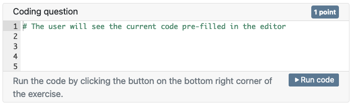
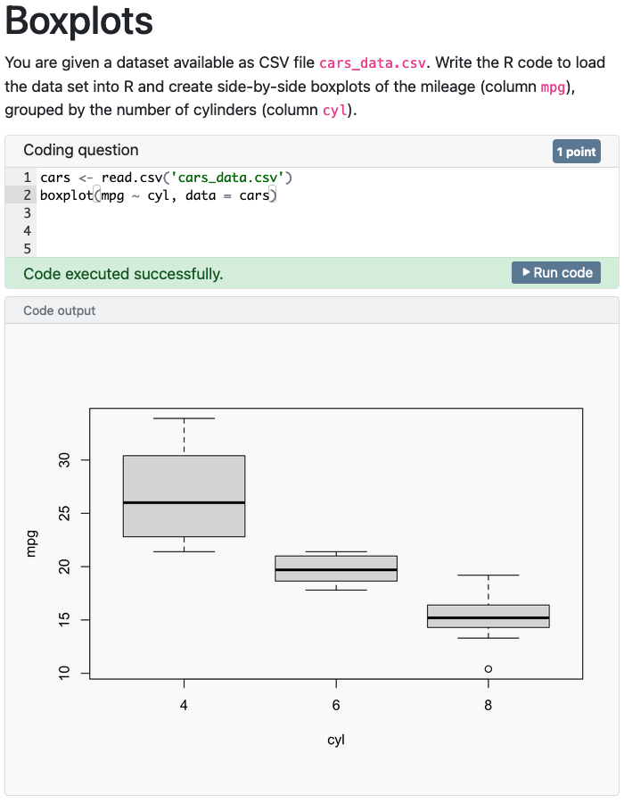
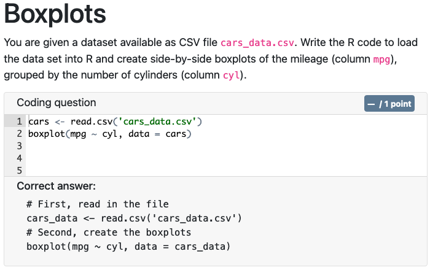

```{r setup, include = FALSE}
knitr::opts_chunk$set(collapse = TRUE, comment = "#>", error = TRUE, warning = TRUE)
esc <- function(code) {
  sprintf('`r %s`', rlang::enexprs(code))
}
begin_rmd_block <- function(header = 'r') {
  sprintf('```{%s}', header)
}
end_rmd_block <- function(header) {
  '```'
}
```

Coding exercises allow you to incorporate assessing R coding skills in your exams.
Exercises are modeled after the concept with the same name in the [learnr package](https://rstudio.github.io/learnr/exercises.html).
Although there are many similarities between exercises in examinr and learnr, there are also some important differences, which are highlighted below to avoid issues.

## Using exercises in exams

Using exercises in an exam document is as simple as adding an R code chunk to the document, with chunk option `exercise=TRUE`, for example:

````md
`r begin_rmd_block("r question_1, exercise=TRUE")`
# The user will see the current code pre-filled in the editor
`r end_rmd_block()`
````

The user would see this as

{width=75%}

The code in the exercise chunk is pre-filled in the editor, but will not be evaluated automatically.
The code will only be evaluated when the user clicks the _Run code_ button.

**Difference to learnr:** user code has access only to the environment created by the exercise data provider.
User code does not have access to any R objects from the R markdown document.

### Setup and solution chunks

Exercises can reference other R code chunks in the document by their label to be used as setup code or solution.
Neither setup nor solution chunks will be evaluated when rendering the document, but are extracted for later use.

Setup chunks are run immediately before the user code in the exact same environment.
This is useful for preparing the environment (e.g., creating files or transforming data).
Setup chunks can also create output (if the chunk options are set accordingly) which is included in the output of the user code.
It is important to know that the setup chunk, just like user code, doesn't have access to the environment of the exam document.
Both are completely separated.
Furthermore, the state of the random number generator in the setup chunk is not determined by the current attempt.
As such, randomization in the setup chunk is **not reproducible.**
Any randomization must be done in the exercise data provider, as explained in the [companion vignette on randomizing exams](randomized_exam.html#randomization-in-exercises).

Solution chunks are currently only used for feedback and are not intended for grading the user code.
They are never evaluated.

````markdown
# Boxplots

You are given a dataset available as CSV file `cars_data.csv`.
Write the R code to load the data set into R and create side-by-side boxplots
of the mileage (column `mpg`), grouped by the number of cylinders (column `cyl`).

`r begin_rmd_block("r q_2-setup")`
# The code in the setup chunk is run immediately before the user code.
# We can, for instance, write data to a file which is accessible by the user code.
write.csv(mtcars, file = 'cars_data.csv', row.names = TRUE)
`r end_rmd_block()`

`r begin_rmd_block("r question_2, exercise=TRUE, exercise.setup='q_2-setup', exercise.solution='q_2-sol'")`

`r end_rmd_block()`

`r begin_rmd_block("r q_2-sol")`
# First, read in the file
cars_data <- read.csv('cars_data.csv')
# Second, create the boxplots
boxplot(mpg ~ cyl, data = cars_data)
`r end_rmd_block()`
````

During the exam, the user would only see the exercise chunk and have access to the environment transformed by the
setup chunk:

{width=75%}

The code from the solution chunk will be shown on the feedback page:

{width=75%}

#### Caveats
It is important to note that every **exercise chunk must have a label** (in the example above this is *question_1*).
This is used as the question identifier in the exported grades.
Furthermore, exercise chunks **must not be completely empty**.
A single blank line is sufficient.


## Configuration

Exercise chunks can be configured via chunk options or globally via the `exam_configuration()` function.
Options set as chunk options must be prefixed with `exercise.` and take precedence over the global configuration.
For example setting the time-limit to 10 seconds for all exercises can be done via `exercise_options(timelimit = 10)`, while adding the chunk option `exercise.timelimit=10` to an exercise chunk changes the time limit only for this one exercise.

The supported options are

Option           Description                                                                 Default value
---------------  -------------------------------------------------------                     ---------------------------
`points`         the number of points the exercise is worth                                  1
`setup`          label of an R code chunk which is evaluated before the user code            none
`solution`       label of an R code chunk holding the solution to the exercise code chunk    none
`timelimit`      time limit for the code to run (in seconds)                                 5
`title`	         title of the exercise                                                       `exercise$panelTitle` from `status_messages()`
`button`         label of the run exercise button                                            `exercise$buttonLabel` from `status_messages()`
`label`          a label to help screen readers describe the purpose of the input element    `exercise$label` from `status_messages()`
`lines`          the minimum number of lines in the code editor                              5
`autocomplete`   enable or disable auto-completion in the code editor                        `TRUE`
`df_print`       method used for printing data frames created by the user code               Inherited from the document

Some options only make sense when set for a particular exercise chunk, especially `exercise.solution`.
Several exercise chunks can share the same setup chunk.

**Difference to learnr:** note that examinr does not use the label of code chunks to determine setup and solution chunks.
An exercise only uses the setup/solution chunk set via `exercise.setup` and `exercise.solution`.

## Evaluating user code

User code is evaluated on the server which raises security and performance issues.
By default, examinr uses the [future](https://cran.r-project.org/package=future) package for evaluating the user code, possibly asynchronously.

The examinr package sanitizes the environment variables to avoid possibly leaking secrets and other sensitive information to user code, but there are currently no other restrictions.

To leverage asynchronous evaluation of user code you must use `future::plan()` to configure the future strategy.
The following plan is the minimum recommended for asynchronous evaluation, but more worker processes may be necessary for exams with heavy computing:

```r
#! context="server-start"
library(future)
plan(cluster, workers = 1)
```


### Writing your own evaluator

The default `future_evaluator()` function creates a future according to the specified `plan`, but you can change the exercise evaluator with `exam_config(exercise_evaluator=)`.
This would be useful if you want to impose further restrictions on the evaluation of user code, e.g., stricter limits on hardware limits and access rights.
On Unix systems, you could use functions `rlimit_*()` from package [unix](https://cran.r-project.org/package=unix) for setting resource limits or use [RAppArmor](https://cran.r-project.org/package=RAppArmor) for even more control.

The exercise evaluator is a function taking the arguments specified below and returning a [_promise_ object](https://rstudio.github.io/promises/).

Argument      Description
-----------   --------------------------------------------
`expr`        an R expression to evaluate
`envir`       environment in which to evaluate the R expression
`label`       label of the exercise chunk
`timelimit`   configured time limit (in seconds)
`...`         currently not used

Your exercise evaluator is expected to ensure that the time limit is adhered to.
The expression `expr` must be evaluated in `envir` and the examinr package must be available in the R process evaluating the expression.
