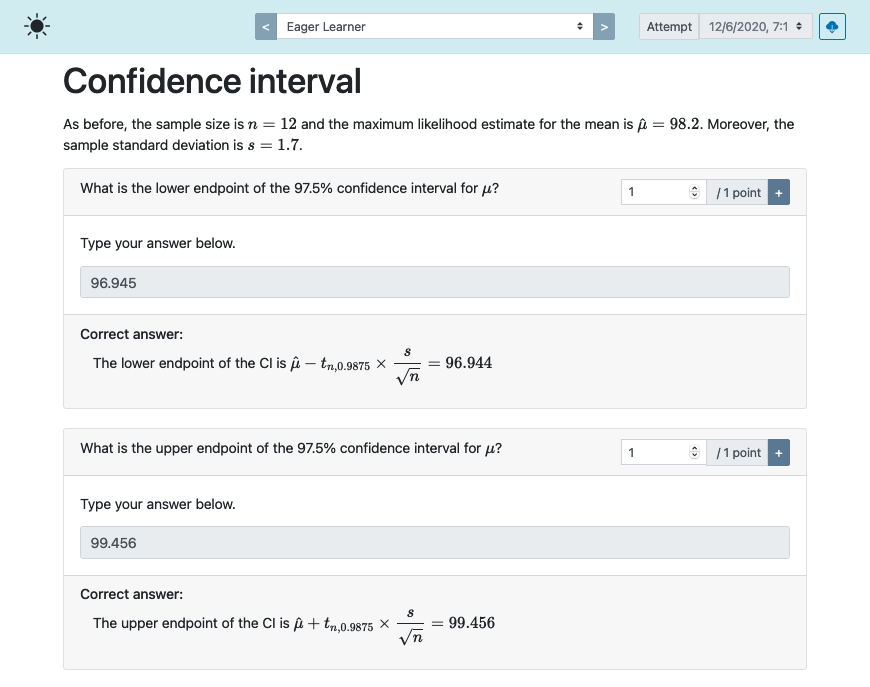

```{r setup, include = FALSE}
knitr::opts_chunk$set(collapse = TRUE, comment = "#>", error = TRUE, warning = TRUE)
esc <- function(code) {
  sprintf('`r %s`', rlang::enexprs(code))
}
begin_rmd_block <- function(header = 'r') {
  sprintf('```{%s}', header)
}
end_rmd_block <- function(header) {
  '```'
}
```

Grading is arguably one of the most time-consuming tasks of conducting an exam.
Exams created with examinr come with a grading interface to support you in this task.
Moreover, some question types (numeric questions and multiple-choice questions) are automatically graded, but still give you the opportunity to override these grades.

## Accessing the grading interface

The grading interface is available under the same path as the exam document, but you need to append `display=feedback` to the query string.
For instance, if the exam is available under `http://127.0.0.1:8181/exam.Rmd`, the grading interface would be accessible under `http://127.0.0.1:8181/exam.Rmd?display=feedback`.
If the user accessing this page does not have grading permissions, the user will see only their individual feedback (if the feedback has been made public already).
Only users with grading permissions are able to access the grading interface.


## Using the grading interface

{width=90%}

At the top of the grading interface are two controls to select the learner (center) and the learner's attempt (right).
The button at the top right is to export the grades for all learners as CSV file.


