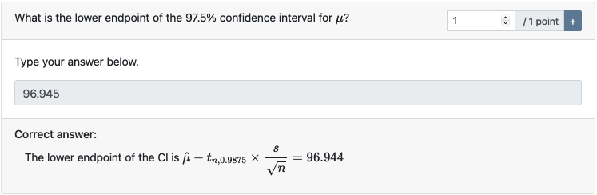
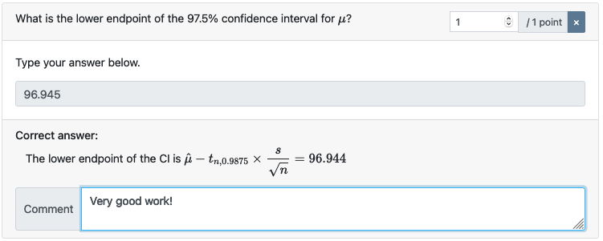

```{r setup, include = FALSE}
knitr::opts_chunk$set(collapse = TRUE, comment = "#>", error = TRUE, warning = TRUE)
esc <- function(code) {
  sprintf('`r %s`', rlang::enexprs(code))
}
begin_rmd_block <- function(header = 'r') {
  sprintf('```{%s}', header)
}
end_rmd_block <- function(header) {
  '```'
}
```

Grading is arguably one of the most time-consuming tasks of conducting an exam.
Exams created with examinr come with a grading interface to support you in this task.
Moreover, some question types (numeric questions and multiple-choice questions) are automatically graded, but still give you the opportunity to override these grades.

## Accessing the grading interface

The grading interface is available under the same path as the exam document, but you need to append `display=feedback` to the query string.
For instance, if the exam is available under `http://127.0.0.1:8181/exam.Rmd`, the grading interface would be accessible under `http://127.0.0.1:8181/exam.Rmd?display=feedback`.
If the user accessing this page does not have grading permissions, the user will see only their individual feedback (if the feedback has been made public already).
Only users with grading permissions are able to access the grading interface.

## Using the grading interface

{width=75%}

At the top of the grading interface is the control bar for selecting the learner (center) and the learner's attempt:

{width=100%}

Attempts are identified and ordered by the time they have been finished (i.e., the last section was submitted).
By default, the learner's latest finished attempt is selected.
You can also select un-finished attempts
Selecting the learner/attempt will re-render the page in the state as shown to the learner for this attempt, and update the solutions according to the realized values.
The button on the far right exports grades for all learners.
[See below](#exporting-grades) for details on the export.

### Grading a question

{width=100%}

You can set the number of points awarded to the learner for their answer using the input at the top right corner of every question.
You can add an individual comment, only visible to this learner, by clicking on the "+" button next to the points:

{width=100%}

The comment can be removed by clicking on the "&times;" button.
Points and comments are automatically saved as soon as they entered.

### Exporting grades

Grades for all learners and attempts are exported by clicking on the download button at the far right of the control bar.

 exam     exam_version    user_id         attempt           question                      submitted                                           points         points_available
-------  --------------  ------------   -------------   ----------------    ----------------------------------------------------------  ----------------  ------------------------------------------
exam id   exam version    learner id     attempt id      question label      date-time of submission (`NA` for un-finished attempts)     points awarded    total points available for the question

