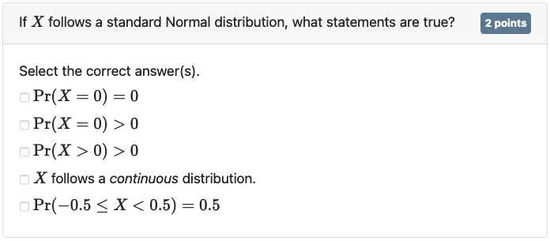
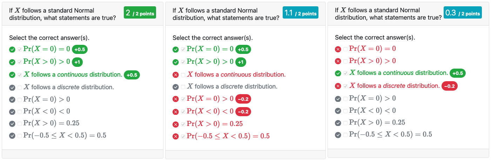

```{r setup, include = FALSE}
knitr::opts_chunk$set(collapse = TRUE, comment = "#>", error = TRUE, warning = TRUE)
esc <- function(code) {
  sprintf('`r %s`', rlang::enexprs(code))
}
begin_rmd_block <- function(header = 'r') {
  sprintf('```{%s}', header)
}
end_rmd_block <- function(header) {
  '```'
}
```

Exam documents are basically a collection of questions.
Questions are added to an exam by calling any of the `*_question()` functions from an R code chunk in the exam document.
Currently examinr supports two basic kinds of questions: multiple-choice questions and "text" questions.
Text questions encompass any kind of question requiring the learner to enter a value in a text box, including numeric answers.

Questions are by default identified by the label of the R code chunk in which they are defined.
If you want to define multiple questions in one code chunk, you must use the `id` argument to set a unique id (unique within the exam document).

## Multiple-choice questions

Multiple-choice and single-choice questions are added via `mc_question()`.
The question is by default multiple-choice (argument `mc=TRUE`) and answer options are displayed with check-boxes, allowing the learner to select any number of answer options.

The following R code produces a simple MC question displayed below

```r
mc_question(
  title = "If $X$ follows a standard Normal distribution, what statements are true?",
  points = 2,
  answer(r"($\Pr(X = 0) = 0$)", correct = TRUE),
  answer(r"($\Pr(X > 0) > 0$)", correct = TRUE),
  answer(r"($X$ follows a _continuous_ distribution.)", correct = TRUE),
  answer(r"($X$ follows a _discrete_ distribution.)"),
  answer(r"($\Pr(X = 0) > 0$)"),
  answer(r"($\Pr(X < 0) < 0$)"),
  answer(r"($\Pr(X > 0) = 0.25$)"),
  answer(r"($\Pr(-0.5 \leq X < 0.5) = 0.5$)"))
```



By default, `mc_question()` will randomly select 5 answer options from the pool of supplied answer options.
At least one correct answer option is always displayed.
If you would rather want to restrict learners to select only a single option, you can set `mc=FALSE`.
In this case exactly one answer option will be displayed.

Answer options are added by supplying `mc_question()` with an arbitrary number (at least one) of unnamed objects created with `answer()`.
An answer option is a _label_ (the text shown to the learner) and some metadata.
Both the question title and answer labels may contain commonmark markdown and LaTeX formulas (within \$ delimiters).
For simple answer options, as in the example above, `correct` may be simply a constant (`TRUE` or `FALSE`).
For more complex scenarios you can also supply an expression which will be evaluated at run-time in the environment created by the data provider (explained in detail in the [companion vignette on randomization](randomized_exam.html)).
The expression must yield either `TRUE` or `FALSE` depending on the randomized values for the attempt.

Consider an example where the learner is asked to decide whether a certain test rejects the null hypothesis in favor of the alternative.
Assume the data provider randomly draws the value of the test statistic (`test_stat`) and the significance level (`sign_level`), and also returns the critical value (`crit_value`).
The MC question can be written as:

```r
mc_question(title = "Does the test reject the null at a significance level of `r esc(significance_level)`?",
            answer("Yes", correct = abs(test_stat) >= crit_value),
            answer("No", correct = abs(test_stat) < crit_value))
```

### Changing the number of displayed answer options

The number of answer options shown at any time is determined by the argument `nr_answers`, which can either be a single number or a vector of two numbers.

If a single number, `nr_answers` determines how many answer options in total will be shown.
The number of shown _correct_ answer options is either exactly 1 (if `mc=FALSE`) or varies between 1 and `nr_answers` (if `mc=TRUE`).

If `nr_answers` is a vector of two numbers, the first number determines the number of _correct_ answer options to display and the second number determines the number of _incorrect_ answer options to display.

**Important:**
You must ensure to provide enough correct and incorrect answer options to satisfy the requested number of answer options.
Since correctness is only determined at run-time, examinr cannot warn you at the time of knitting if there will be enough correct/incorrect answer options available.
In particular, you must ensure that at least one answer option is correct.

### Grading

Multiple-choice questions are automatically graded upon submission of the section.
The score on a question (out of the total `points`) is determined by the `weight` of the selected answer options.

The argument `answer(weight=)` is a numeric vector of two elements: the first element is the weight applied if the answer option is incorrect and the second element is the weight applied if the answer option is correct.
If `correct` is a constant (and known when knitting), `weight` can also be a single number.
In this case `weight = w` is equivalent to `weight = c(0, w)` if `correct=TRUE` or to `weight = c(w, 1)` if `correct=FALSE`.

Weights for correct answer options are standardized, such that the sum of all shown, correct answer options is 1.
Weights for incorrect answer options are not standardized and interpreted as a proportion of the total points available.
For example, a weight of `weight = c(-0.5, 1)` for an incorrect answer option would reduce the score by 50% of the total points available for the question.

The total score $p$ is computed as

$$
p = t \times \left(\frac{ \sum_{i \in C} w_{i 2} s_i } { \sum_{i \in C} w_{i 2} } + \sum_{i \in I} w_{i 1} \right).
$$
where

 - $t$ is the total number of points available for the question,
 - $C$ and $I$ are the set of correct and incorrect answer options, respectively,
 - $w_{i 1}$ and $w_{i 2}$ are the two weight values associated with the $i$-th answer option,
 - $s_i$ is 1 if the learner selected answer option $i$ and 0 otherwise.

By default a learner cannot get a negative score on a question, but this can be changed via argument `mc_question(min_points=)`.
If you would set `min_points=-0.5`, for example, a learner may be penalized with up to -0.5 points.

Considering the example from above (but ignoring randomization)

```r
mc_question(
  title = "If $X$ follows a standard Normal distribution, what statements are true?",
  points = 2, nr_answers = 8, random_answer_order = FALSE,
  answer(r"($\Pr(X = 0) = 0$)", correct = TRUE, weight = c(0, 2)),
  answer(r"($\Pr(X > 0) > 0$)", correct = TRUE, weight = 2),
  answer(r"($X$ follows a _continuous_ distribution.)", correct = TRUE, weight = 1),
  answer(r"($X$ follows a _discrete_ distribution.)", weight = -0.1),
  answer(r"($\Pr(X = 0) > 0$)", weight = -0.1),
  answer(r"($\Pr(X < 0) < 0$)", weight = -0.1),
  answer(r"($\Pr(X > 0) = 0.25$)", weight = 0),
  answer(r"($\Pr(-0.5 \leq X < 0.5) = 0.5$)", weight = 0))
```

The second answer option is worth twice as much as the other correct answer options.
Selecting some of the incorrect answer options will be penalized by 10% of the total points available (i.e., by -0.2 points).
This is also shown on the feedback page (for 3 different response patterns):

{width=100%}


### Changing randomization

By default `mc_question()` randomly selects from the pool of supplied answer options and also randomizes the order of the answer options.
You can disable the shuffling by setting the argument `mc_question(random_answer_order=)` to `FALSE`.
If you want an answer option to be always displayed, you can set the argument `answer(always_show=)` to `TRUE`.


## Text questions

The second question type supported by examinr are text questions, created via `text_question()`.
Currently, text questions accept either numeric answers (`type="numeric"`), single-line text answers (`type="text"`), or multi-line text answers (`type="textarea"`).

### Grading

You can supply the solution to a text question via the `solution` expression.
The expression is evaluated at run-time and hence has access to all objects created by the data provider.
The expression must yield a character string (or it will be forcefully cast to one) and can include commonmark markdown and math notation.

Moreover, numeric answers are auto-graded if the `solution` expression either yields (a) a numeric value or (b) a character value with numeric attribute _answer_.
This number is compared with the learner's answer using the function given in `text_question(comp=)`.
The comparison function must take arguments `input`, the value input by the learner, and `answer`, the correct numeric value as given by the `solution` expression.
The comparison function can assume that `input` is a single number and no validation of the learner input is necessary.

The examinr package ships with 3 default comparison functions:

- `comp_abs(tol)`, checks if the absolute difference between the learner's input and the correct answer is less or equal than `tol` (equivalent to `abs(input - answer) <= tol`).
- `comp_rel(tol)`, checks if the relative difference between the learner's input and the correct answer is less or equal than `tol` (equivalent to `abs(input / answer - 1) <= tol`).
- `comp_digits(digits, pm)`, which is the default, compares the learner's input and the correct answer rounded to `digits` digits significant digits _after the decimal point_.
  This allows for small discrepancies in the last digits requested from the learner.
  If the absolute value of the correct answer is greater than 1, the comparison is equal to `abs(input - answer) < pm * 10^-digits`, and hence the same as `comp_abs(pm * 10^-digits)`.
  If the absolute value of the correct answer is less than 1, the comparison is equal to `10^s * abs(input - answer) < pm * 10^-digits`, where `s` is such that `abs(10^s * answer)` is less than 1 and the first digit after the decimal mark is non-zero (i.e., shifting the decimal point to the right just before the first non-zero digit).
  Consider for example, `comp_digits(digits=3, pm=1)` is used to compare the learner's input against a correct answer of _0.000065**2**412_, anything between _0.000065**1**412_ and _0.000065**3**412_ would be accepted.

## Mandatory questions

You can make questions mandatory by setting the argument `mandatory` to `TRUE`.
Learners cannot submit the answers unless they answer the mandatory questions.
For MC questions, the learner needs to select (at least) one option, and for text questions any non-empty response is accepted.
