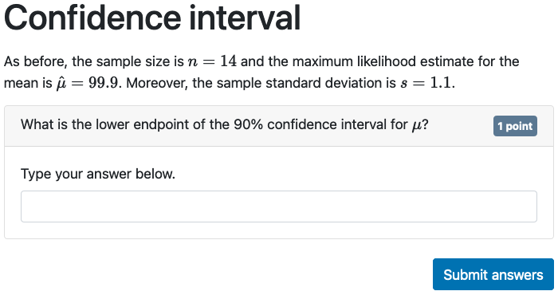
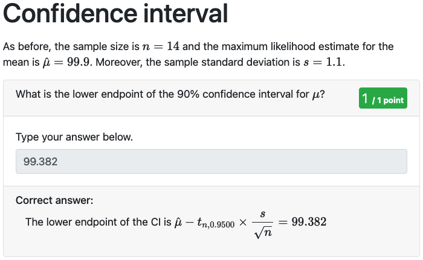
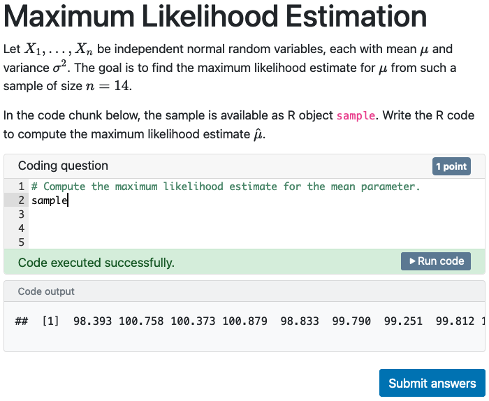

```{r setup, include = FALSE}
knitr::opts_chunk$set(collapse = TRUE, comment = "#>", error = TRUE, warning = TRUE)
esc <- function(code) {
  sprintf('`r %s`', rlang::enexprs(code))
}
begin_rmd_block <- function(header = 'r') {
  sprintf('```{%s}', header)
}
end_rmd_block <- function(header) {
  '```'
}
```

Almost every aspect of an exam can be randomized: section order, question texts (text blocks, question titles, answer options, etc, correct answers, etc), and exercises.
Randomization is based on exam-specific data providers: one for question texts and one for exercise chunks.
Question texts only have access to data generated by the data provider set in the _setup_ chunk via `data_provider()`.
Exercise code only has access to data generated by the exercise data provider set via `exam_config(exercise_data_provider=)`.

## Randomization in questions and text blocks

The only R objects accessible in the main body of the R Markdown document are the ones returned by the data provider set via `data_provider()`.
The data provider is a function which generates all (randomized) data which may change between users and attempts.
It receives arguments `section` (identifier of the currently visible section), `attempt` (information about the current attempt), `session` (the current Shiny session object), and `...` (for future expansions).
Arguments `attempt` and `session` may be `NULL` if the data provider is invoked during pre-rendering of the exam.
The function must return either a `list` or an `environment` (the parent environment will be stripped).
Before calling the data provider, the seed for the RNG is automatically set according to the current attempt to ensure the data provider always returns the same values for a given attempt.
The data provider is not only invoked when displaying the exam to the user, but also when pre-rendering the exam, when showing feedback and when grading.

For progressive exams, the data provider is invoked for a specific section, while in any other case it is invoked with `section = TRUE`.

As example, consider the following data provider:

```{r, eval=FALSE}
data_provider(function (section, attempt, session, ...) {
  # Create the environment and some values used in all sections:
  objs <- list(sample_size = sample(8:14, 1),
               sample_mean = round(rnorm(1, mean = 100), 1),
               sample_sd = round(runif(1, 1, 3), 1))

  section_seeds <- sample.int(.Machine$integer.max, 2)
  
  if (isTRUE(section) || identical(section, 'maximum-likelihood-estimation')) {
    # For MLE, users need an actual sample
    set.seed(section_seeds[1])
    objs$sample <- with(objs, round(rnorm(sample_size), 2) * sample_sd + sample_mean)
  }
  
  if (isTRUE(section) || identical(section, 'confidence-interval')) {
    # In the confidence interval section we ask for a specific confidence level.
    set.seed(section_seeds[2])
    objs$conf_level <- sample(c(0.995, 0.99, 0.975, 0.95, 0.90), 1)
  }
  
  return(objs)
})
```

There are a few important guidelines for writing your own the data provider.
First and foremost, section-specific randomization **must not interfere** with each other.
This ensures that calling the data provider with `section = TRUE` gives the same values, e.g., for `conf_level`, as if calling the data provider with `section = 'confidence-interval'`.
The data provider will always be called with `section = TRUE` when showing feedback to users and when grading, as in these cases all sections are shown at once.
For progressive exams, however, the data provider is called only for the currently visible section.
Furthermore, for performance reasons it is good practice to only generate the data for the requested sections.

In the example above, section-specific randomization is done by setting a section-specific seed when generating the data for the individual sections.
Another option would be to use [`withr::with_preserve_seed()`](https://withr.r-lib.org/reference/with_seed.html).

If the generated data is small but takes a long time to compute, consider caching the data by setting `data_provider(cache_data = TRUE)`.
This will cache the generated data in the Shiny session and the data provider will be invoked only once for every attempt and section.

### Using randomized values

Using randomized data in an exam document is the same as using R objects in a standard R Markdown document: via R code chunks.
The section on confidence intervals, for example, may look something like

````markdown
`r begin_rmd_block("r setup")`
# Set the data provider in the setup chunk
data_provider(function (section, attempt, session, ...) {
  # Create the environment and some values used in all sections:
  objs <- list(sample_size = sample(8:14, 1),
               sample_mean = round(rnorm(1, mean = 100), 1),
               sample_sd = round(runif(1, 1, 3), 1))

  section_seeds <- sample.int(.Machine$integer.max, 2)
  
  if (isTRUE(section) || identical(section, 'maximum-likelihood-estimation')) {
    # For MLE, users need an actual sample
    set.seed(section_seeds[1])
    objs$sample <- with(objs, round(rnorm(sample_size), 2) * sample_sd + sample_mean)
  }
  
  if (isTRUE(section) || identical(section, 'confidence-interval')) {
    # In the confidence interval section we ask for a specific confidence level.
    set.seed(section_seeds[2])
    objs$conf_level <- sample(c(0.995, 0.99, 0.975, 0.95, 0.90), 1)
  }
  
  return(objs)
})
`r end_rmd_block()`

# Confidence interval

As before, the sample size is $n = `r esc(sample_size)`$ and the maximum likelihood estimate for the
mean is $\hat\mu = `r esc(sample_mean)`$.
Moreover, the sample standard deviation is $s = `r esc(sample_sd)`$.

`r begin_rmd_block("r ci_q_1")`
text_question(
  title = r"(What is the lower endpoint of the `r esc(conf_level * 100)`% confidence interval for $\mu$?)",
  type = "numeric", accuracy = 1e-3,
  solution = {
    t_quantile <- 1 - (1 - conf_level) / 2
    ci_lower <- sample_mean - qt(t_quantile, df = sample_size - 1) * sample_sd / sqrt(sample_size)
    structure(sprintf(r"[The lower endpoint of the CI is $\displaystyle \hat\mu - t_{n,%.4f} \times
                         \frac{s}{\sqrt{n}} = %.3f$]", t_quantile, ci_lower),
              answer = ci_lower)
  })
`r end_rmd_block()`
````

_(Note: the above R code chunk uses raw character constants as introduced in R 4.0, avoiding the need to double-escape backslashes in the MathJax equations.)_

The R objects generated by the data provider are used via inline R code chunks in the question text and in the question title.
The rendered section looks like this:

{width=75%}

The data from the data provider is also available when computing the solution to the question.
The `solution` expression is evaluated in an environment generated from the value returned by the data provider.
The feedback to the user looks like this:

{width=75%}

#### Performance considerations

Prefer inline R code chunks (i.e.,`` `r esc('...')` ``) over R code blocks of the form

````markdown
`r begin_rmd_block()`
# ...
`r end_rmd_block()`
````

If the section contains only inline R chunks, examinr uses `commonmark::markdown_html()` to parse the markdown to HTML.
Whenever a section contains R code blocks, however, `rmarkdown::render()` function is invoked which is much slower.
This will be important if many users access the exam at the same time and the same R process.

## Randomization in exercises

Exercises are slightly different than regular question texts in that the data available in the exercises is generated via the exercise data provider configured with `exam_config(exercise_data_provider=)`.

The exercise data provider is invoked when the user runs their code for an exercise chunk and when examinr builds the information needed for auto-completion.
The exercise data provider is invoked with arguments `label` (identifier of the exercise chunk), `attempt` (information about the current attempt), `session` (the current Shiny session object), and `...` (for future expansions).
Arguments `attempt` and `session` are `NULL` when the provider is invoked for determining the objects available for auto-completion.
The restrictions and notes given above for the data provider also apply to the exercise data provider.

In many situations, the data provider and the exercise data provider share many objects.
In these cases, it is sensible to write a helper function (below called `common_data_provider()`) which generates the data and is invoked by both data providers, for instance

```r
common_data_provider <- function (section) {
  # Create the environment and some values used in all sections:
  objs <- list(sample_size = sample(8:14, 1),
               sample_mean = round(rnorm(1, mean = 100), 1),
               sample_sd = round(runif(1, 1, 3), 1))

  section_seeds <- sample.int(.Machine$integer.max, 2)
  
  if (isTRUE(section) || identical(section, 'maximum-likelihood-estimation')) {
    # For MLE, users need an actual sample
    set.seed(section_seeds[1])
    objs$sample <- with(objs, round(rnorm(sample_size), 2) * sample_sd + sample_mean)
  }
  
  if (isTRUE(section) || identical(section, 'confidence-interval')) {
    # In the confidence interval section we ask for a specific confidence level.
    set.seed(section_seeds[2])
    objs$conf_level <- sample(c(0.995, 0.99, 0.975, 0.95, 0.90), 1)
  }
  
  return(objs)
}
```

In this example, the data provider may simply forward to the common data provider:

```r
# Set the data provider in the setup chunk
data_provider(function (section, attempt, session, ...) {
  return(common_data_provider(section))
})
```

The exercise data provider, on the other hand, would return only the objects the user should have access to in the exercise chunk:

```r
# Set the data provider in a "server-start" chunk
exam_config(exercise_data_provider = function (label, attempt, session, ...) {
  if (identical(label, 'mle_q_1')) {
    objs <- common_data_provider('maximum-likelihood-estimation')
    # For this exercise, the user only needs access to the sample.
    return(objs['sample'])
  }
  return(list())
})
```

Note that the data provider must be set in a _setup_ chunk (it must be available both at rendering time and on the server), while the exercise data provider is set only in a _server-start_ context.

The section on maximum likelihood estimation may then look something like

````markdown
`r begin_rmd_block("r setup")`
common_data_provider <- function (section) {
  # Create the environment and some values used in all sections:
  objs <- list(sample_size = sample(8:14, 1),
               sample_mean = round(rnorm(1, mean = 100), 1),
               sample_sd = round(runif(1, 1, 3), 1))

  section_seeds <- sample.int(.Machine$integer.max, 2)
  
  if (isTRUE(section) || identical(section, 'maximum-likelihood-estimation')) {
    # For MLE, users need an actual sample
    set.seed(section_seeds[1])
    objs$sample <- with(objs, round(rnorm(sample_size), 2) * sample_sd + sample_mean)
  }
  
  if (isTRUE(section) || identical(section, 'confidence-interval')) {
    # In the confidence interval section we ask for a specific confidence level.
    set.seed(section_seeds[2])
    objs$conf_level <- sample(c(0.995, 0.99, 0.975, 0.95, 0.90), 1)
  }
  
  return(objs)
}
data_provider(function (section, attempt, session, ...) {
  return(common_data_provider(section))
})
`r end_rmd_block()`

`r begin_rmd_block("r, context=\"server-start\"")`
exam_config(exercise_data_provider = function (label, attempt, session, ...) {
  if (identical(label, 'mle-q-1')) {
    objs <- common_data_provider('maximum-likelihood-estimation')
    # For this exercise, the user only needs access to the sample.
    return(objs['sample'])
  }
  return(list())
})
`r end_rmd_block()`

# Maximum Likelihood Estimation

Let $X_1, \dotsc, X_n$ be independent normal random variables, each with mean $\mu$ and variance
$\sigma^2$.
The goal is to find the maximum likelihood estimate for $\mu$ from such a sample of size
$n = `r esc(sample_size)`$.

In the code chunk below, the sample is available as R object `sample`.
Write the R code to compute the maximum likelihood estimate $\hat\mu$.


`r begin_rmd_block("r mle_q_1, exercise=TRUE, exercise.solution=\"mle_q_1-solution\"")`
# Compute the maximum likelihood estimate.
`r end_rmd_block()`

`r begin_rmd_block("r mle_q_1-solution, eval=FALSE")`
# The MLE for the mean parameter is the mean of the observed values:
mu_mle <- mean(sample)
`r end_rmd_block()`
````

The user would see something like the following:

{width=75%}

If computations in the exercise data provider are slow, but the data itself is small, consider caching the results with `exam_config(cache_data = TRUE)`.

### Randomization and setup chunks

Exercises also support setup chunks which are always run immediately before the user code.
Setup chunks see the same environment as the user code and thus has access to the data created by the exercise data provider.
The RNG is not seeded before running setup chunks (or user code), and therefore cannot be used directly to create reproducible data for users.

Setup chunks are useful for transforming the data generated by the data provider, e.g., saving the data to disk for the user to read in.
An alternative version of the MLE question from above could be 

````markdown
<!-- setup the data providers as above -->

# Maximum Likelihood Estimation

Let $X_1, \dotsc, X_n$ be independent normal random variables, each with mean $\mu$ and variance
$\sigma^2$.
The goal is to find the maximum likelihood estimate for $\mu$ from such a sample of size
$n = `r esc(sample_size)`$.

In the code chunk below, the sample is available in the file _./sample.csv_.
Write the R code to read in the data and compute the maximum likelihood estimate $\hat\mu$.

`r begin_rmd_block("r mle_q_1-setup")`
# Write data to disk and hide from the user
write.csv(data.frame(x = sample), file = "sample.csv", row.names = FALSE)
rm(sample)
`r end_rmd_block()`

`r begin_rmd_block("r mle_q_1, exercise=TRUE, exercise.solution=\"mle_q_1-setup\", exercise.solution=\"mle_q_1-solution\"")`
# Read in the data and compute the maximum likelihood estimate.
`r end_rmd_block()`

`r begin_rmd_block("r mle_q_1-solution, eval=FALSE")`
# Read in the sample values
sample <- read.csv("sample.csv")
# The MLE for the mean parameter is the mean of the observed values:
mu_mle <- mean(sample$x)
`r end_rmd_block()`
````

More information on using setup and solution chunks is available the [companion vignette on exercise chunks](exercises.html).

## Customizing the seed

By default, all attempts by a user will be seeded with the same seed determined from the user's id.
Sometimes, it is useful to use different seeds for different attempts, or maybe the same seed for several users.
To customize the seed used for an attempt, you can specify a seeding function via `exam_config(seed_attempt=)`.
The seeding function is called arguments `user` (the current user), `previous_attempts` (a list of all previous attempts by this user), and `...` (for future expansion).
It should return a single integer which will be used to seed the RNG for the attempt.

To give different seeds for every attempt, for example, you can use the following:

```r
exam_config(seed_attempt = function (user, previous_attempts, ...) {
  digest::digest2int(paste(user$user_id, length(previous_attempts)))
})
```

The [companion vignette on controlling access to exams](congi_access.html#authentication-provider) contains more information about the user object.
